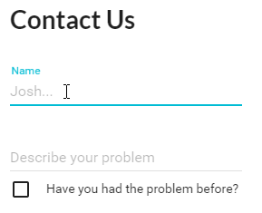

## Meteor-React-Autoform
`meteor-react-autoform` will translate your Meteor [aldeed:SimpleSchema](https://github.com/aldeed/meteor-simple-schema) into a [React](https://github.com/facebook/react) form using [Material-UI](https://github.com/callemall/material-ui) components. You can wrap tests around your component and/or the Autoform component, this will also work with [Storybook](https://github.com/kadirahq/react-storybook). This is still in active development but is very possible to use today. Basic form elements are already available, see below for [todo list](#todo-list) and see [Changelog](CHANGELOG.md).

## Example
You can [fork an example application](https://github.com/MechJosh0/mantra-sample-autoform-blog-app) to test Meteor-React-Autoform. This application uses Mantra Sample Blog app as it's base.

## Requirements
1. `React v15` and `Material-UI v0.15`
2. `Meteor v1.3`

## Installation
1. Installed the NPM package: `$ npm i meteor-react-autoform --save`
2. Install the Meteor package: `$ meteor add aldeed:collection2 aldeed:simple-schema`
3. Extend your SimpleSchema to allow our `materialForm` object. Place the below code above your schema definitions ([see example](#example-schema)):
```
  // Documentation -> https://github.com/MechJosh0/meteor-react-autoform
  // Extend the schema to allow our materialForm object
  SimpleSchema.extendOptions({
    materialForm: Match.Optional(Object)
  })
```
4. See the [element examples](#element-examples-list) list to see how to write the `materialForm` object in your schema.

## TODO <a name="todo-list"></a>
 - Array of elements
 - Object fields
 - Array of object fields

## ReactAutoForm props
|Prop|Type|Required|Description|Example|
|---|---|---|---|---|
|`buttonComponent`|`Node`|No|Write and use your own custom button component. Using this will ignore all other `button*` props.|`buttonComponent={<button>Submit button</button>}`|
|`buttonIcon`|`String`|No|Material-UI Icon name, view [available icons](https://design.google.com/icons/).|`buttonIcon="check"`|
|`buttonLabel`|`String`|No|Custom button label.|`buttonLabel="Submit form"`|
|`buttonParentStyle`|`Object`|No|Write the parent div element for the Material-UI button.|`buttonParentStyle={style.buttonParent}`| 
|`buttonProps`|`Object`|No|Write your own props for the [Material-UI button](http://www.material-ui.com/#/components/raised-button). This will overwrite existing props that Autoform creates.|`buttonProps={{secondary: true}}`|
|`buttonType`|`OneOf['FlatButton', 'RaisedButton', 'IconButton']`|No|You can use either the Material-UI [FlatButton](http://www.material-ui.com/#/components/flat-button) or [RaisedButton](http://www.material-ui.com/#/components/raised-button), default is RaisedButton, or you may write your own button using the prop `buttonComponent`.|`buttonType="RaisedButton"`|
|`debug`|`Bool`|No|This will output the form data into the console when the user attempts to submit.|`debug={false}`|
|`doc`|`Object`|No|To update a document you must set the `type="update"` and provide the document you wish to update in the `doc` prop.|`doc={document}`|
|`errors`|`Array`|No|When your submit Action is ran and there is an error, it should update the prop here which will in turn update the form to display errors.|`errors={errors}`|
|`errorsStyle`|`Object`|No|You may provide the style for the errors above the form. [See example](#styleExample).|`errorsStyle={style.errors}`|
|`errorsTitle`|`String`|No|The error header above the form.|`errorsTitle="There was an error:"`|
|`formClass"`|`String`|No|By default the form className is `autoform` however you can choose your own.|`formClass="contactForm"`|
|`formStyle`|`Object`|No|Provide your own form style, [see example](#styleExample).|`formStyle={style.form}`| 
|`muiTheme`|`Bool`|No|Default set to false to allow you to choose your own Material-UI theme, however if you do not have one set up set this to `true` to use the default.|`muiTheme={false}`|
|`onSubmit`|`Function`|Yes|This will run when the user attempts to submit the forum, this will need to be your Action. See [onSubmit](#onSubmit) for more formation.|`onSubmit={this.props.handleInsert}`|
|`onSubmitExtra`|`Object`|Pass an object which is then returned as an extra parameter on the onSubmit function
|`schema`|`Object`|Yes|You must provide the collection you wish to use for building your form.|`schema={{name: {type: String, materialForm: {floatingLabelText: 'Name', hintText: 'Your name...'}}}}`|
|`type`|`OneOf['update', 'insert']`|No|You must set the `type` prop which must equal either `"insert"` or `"update"`.|`type="insert"`|
|`useFields`|`Array`|No|Only produce the fields `name` and `description` from the Collection in the form.|`useFields={['name', 'text']}`|

## Usage
### React Component Example
`/client/modules/contact/components/contact_page.js`
```
    import React from 'react';
    import ReactAutoForm from 'meteor-react-autoform';
    import HelpDeskSchema from '/lib/schema/help_desk';
    
    const HelpDesk = () => (
        <div>
        <h1>Contact Us</h1>
        <ReactAutoForm
            errors={this.props.errors}
            muiTheme={true}
            onSubmit={this.props.handleInsert}
            schema={HelpDeskSchema}
            type="insert"
        />
        </div>
    );
    
    HelpDesk.propTypes = {
        errors: React.PropTypes.array,
        handleInsert: React.PropTypes.func.isRequired
    };
    
    export default HelpDesk;
```
 
## onSubmit <a name="onSubmit"></a>
You will need to provide your [Action](https://kadirahq.github.io/mantra/#sec-Actions) (Meteor/Tracker, Redux, Rx.js, etc) as a prop to the React component. When Autoform is submitted it will call your `onSubmit` Action function. For an `type={'insert'}` form the Action will be called with just the `forumFields` parameter, for example `yourInsertAction(forumFields)`, whereas a form with `type={'update'}` the Action will be called with `docId, formFields` parameters, for example `yourUpdateAction(_id, forumFields)`.
#### Redux Action Example
`/client/modules/contact/actions/contact_page.js`
```
import {HelpDeskSchema} from './../../../../lib/collections/help_desk';
import * as actions from './../action_types';

export default {
  insertTicket(forumFields) // This is the function that is passed to our `handleInsert` prop in the component via our container
  {
    const _id = Meteor.uuid(); // Generates a random _id to be used in MongoDB
    const context = HelpDeskSchema.newContext(); // Gets the schema context
    context.resetValidation(); // Reset any previous data

    const isValid = context.validate(forumFields); // Check is the form from Autoform is valid against our Schema

    if(isValid) // If everything went well
    {
      // Call the Meteor Method to handle inserting into MongoDB
      Meteor.call('helpDesk.insert', _id, forumFields, (err) =>
      {
        if(err)
        {
          return {type: actions.INSERT_TICKET_ERROR, errors: 'Something went wrong'};
        }
      });

      // We've used a Method stub to insert into the clients mini Mongo already so we can go to the new ticket url path before the server handles the request itself 
      FlowRouter.go(`${FlowRouter.path('helpDesk.update')}/${_id}`);

      return {type: actions.INSERT_TICKET_SUCCESS, value: true};
    }

    // There was an error in the form against our schema
    const invalidKeys = context.invalidKeys(); // Get the errors

    Object.keys(invalidKeys).map((field) => // Loop through the errors
    {
      invalidKeys[field].message = context.keyErrorMessage(invalidKeys[field].name); // Translate each error into a readable format
    });

    return {type: actions.INSERT_TICKET_ERROR, errors: invalidKeys}; // Update Redux error array
  }
};
```

My examples follow the Meteor [Mantra specification](https://github.com/kadirahq/mantra) which I recommend following.

## SimpleSchema object
#### Example <a name="example-schema"></a>
`/lib/schema/helpDesk.js`
```
  const schema = {
    name: {
     type: String,
     materialForm: {
       floatingLabelText: 'Your name',
       hintText: 'Sarah Smith...'
     }
    },
    description: {
     type: String,
     min: 10,
     max: 200,
     materialForm: {
       floatingLabelText: 'Describe your problem',
       rows: 1,
       rowsMax: 10,
       multiLine: true,
       hintText: 'I require a password reset...'
     }
    },
    reoccurringProblem: {
      type: Boolean,
      defaultValue: true,
      label: 'Have you had the problem before?',
      materialForm: {
        switcher: 'Checkbox'
      }
    }
  };

  export default HelpDesk;
```

`/lib/collections/helpDesk.js`
```
  import {Mongo} from 'meteor/mongo';
  import Schema from './../schema/help_desk';
  const HelpDesk = new Mongo.Collection('helpDesk');

  SimpleSchema.extendOptions({
    materialForm: Match.Optional(Object)
  });

  const HelpDeskSchema = new SimpleSchema(Schema);

  HelpDesk.attachSchema(HelpDeskSchema);

  export {HelpDesk, HelpDeskSchema};
```

#### Style Example <a name="styleExample"></a>
You may provide styling to the form and error components by following the example:
```
    const HelpDesk = () => (
           <div>
           <h1>Contact Us</h1>
           <ReactAutoForm
               errors={this.props.errors}
               errorsStyle={{
                  container: {
                      background: 'green'
                  },
                  h3: {
                      background: 'red'
                  },
                  ul: {
                      background: 'purple'
                  },
                  li: {
                      background: 'yellow'
                  }
               }}
               muiTheme={true}
               onSubmit={this.props.handleInsert}
               schema={HelpDeskSchema}
               type="insert"
               formStyle={{
                   background: 'blue'
               }}
           />
           </div>
       );
```


### Element Examples <a name="element-examples-list"></a>
- [Text](#element-text)
- [Textarea](#element-textarea)
- [Number](#element-number)
- [Date](#element-date)
- [Tickbox](#element-tickbox)
- [Select Dropdown](#element-selectdropdown)
- [Radio Button](#element-radiobuton)

#### Global parameters
 - `label` String | Input label
 - `max` Number | Set the max length of an input
```
  description: {
    type: String,
    label: 'Description',
    max: 10
  }
```

#### Text <a name="element-text"></a>
A normal text input will only need a type of `String` to display. See [Material-UI text field](http://www.material-ui.com/#/components/text-field) to find what properties are available for passing into our `materialForm` object.
```
  description: {
    type: String,
    materialForm: {
      hintText: 'Please enter the description...'
    }
 }
```
```
  password: {
    type: String,
    label: 'Password',
    materialForm: {
      type: 'password'
    }
  }
```

#### Textarea <a name="element-textarea"></a>
Inside the `materialForm` object, using either `materialForm.rows` `materialForm.rowsMax` or `materialForm.multiLine` will cause the input to turn into a textarea. See [Material-UI text field](http://www.material-ui.com/#/components/text-field) to find what properties are available for passing into our `materialForm` object.
```
  description: {
    type: String,
    materialForm: {
      rows: 1,
      rowsMax: 3,
      multiLine: true
    }
  }
```

#### Number <a name="element-number"></a>
Type `Number` will change the element to a number input. `min` and `max` values are taken into consideration if available. See [Material-UI text field](http://www.material-ui.com/#/components/text-field) to find what properties are available for passing into our `materialForm` object.
```
  favoritePositiveInteger: {
    type: Number,
    max: 10,
    min: 5,
    materialForm: {
      step: 0.2
    }
  }
```


#### Date <a name="element-date"></a>
Type `Date` will provide a date select. `min` and `max` values are taken into consideration if available. See [Material-UI date picker](http://www.material-ui.com/#/components/date-picker) to find what properties are available for passing into our `materialForm` object.
```
  birthday: {
    type: Date,
    label: 'Your birthday',
    defaultValue: new Date('2014-10-18T00:00:00.000Z'),
    materialForm: {
      dateMode: 'landscape',
      autoOk: true
    }
  }
```

#### Tick box <a name="element-tickbox"></a>
Type `Boolean` will use `materialForm.switcher` to determine to display either a checkbox or a toggle component. By default will use the [checkbox Material-UI component](http://www.material-ui.com/#/components/checkbox) `materialForm.switcher = 'Checkbox'`, or if you can change it to use the [toggle component](http://www.material-ui.com/#/components/toggle) `materialForm.switcher = 'Toggle'`. Check out the respective Material-UI documentation on each component to find out what other properties are available for passing into our `materialForm` object.
```
  agree: {
    type: Boolean,
    label: 'Do you agree?',
    defaultValue: false,
    materialForm: {
      switcher: 'Checkbox'
      // OR
      //switcher: 'Toggle'
    }
  }
```

#### Select dropdown menu <a name="element-selectdropdown"></a>
Use `allowedValues = []` to create a select dropdown menu. You can provide `materialForm.options = []` to pass through an object`[label: 'Example', value: 'durp']` for each option. You can pass through any [select-field properties](http://www.material-ui.com/#/components/select-field) by using `materialForm.selectOptions = []`.
```
  choose3: {
    type: Number,
    allowedValues: [
      1,
      2,
      3
    ],
    optional: true,
    label: 'Choose a number',
    materialForm: {
      selectOptions: {
        className: 'selectExample'
      },
      options: [
        {
          label: 'One',
          value: 1
        },
        {
          label: 'Two',
          value: 2
        },
        {
          label: 'Three',
          value: 3
        }
      ]
    }
  }
```

#### Radio button <a name="element-radiobuton"></a>
When you use `allowedValues = []` with `materialForm.switcher = 'Radio'` this will display radio box options. You can provide `materialForm.options = []` and pass through any [RadioButton properties](http://www.material-ui.com/#/components/radio-button) into each option, you can also pass through [RadioButtonGroup properties](http://www.material-ui.com/#/components/radio-button) by using `materialForm.groupOptions = []`.
```
  agree: {
    type: String,
    allowedValues: [
      'red',
      'green'
    ],
    label: 'What colour is the sky?',
    materialForm: {
      switcher: 'Radio',
      groupOptions: {
        className: 'radioExample'
      },
      options: [
        {
          label: 'Red',
          value: 'red'
        },
        {
          label: 'Green',
          value: 'green'
        }
      ]
    }
  }
```

# Credits
Developed and maintained by [Aluminati](http://www.aluminati.net/)
